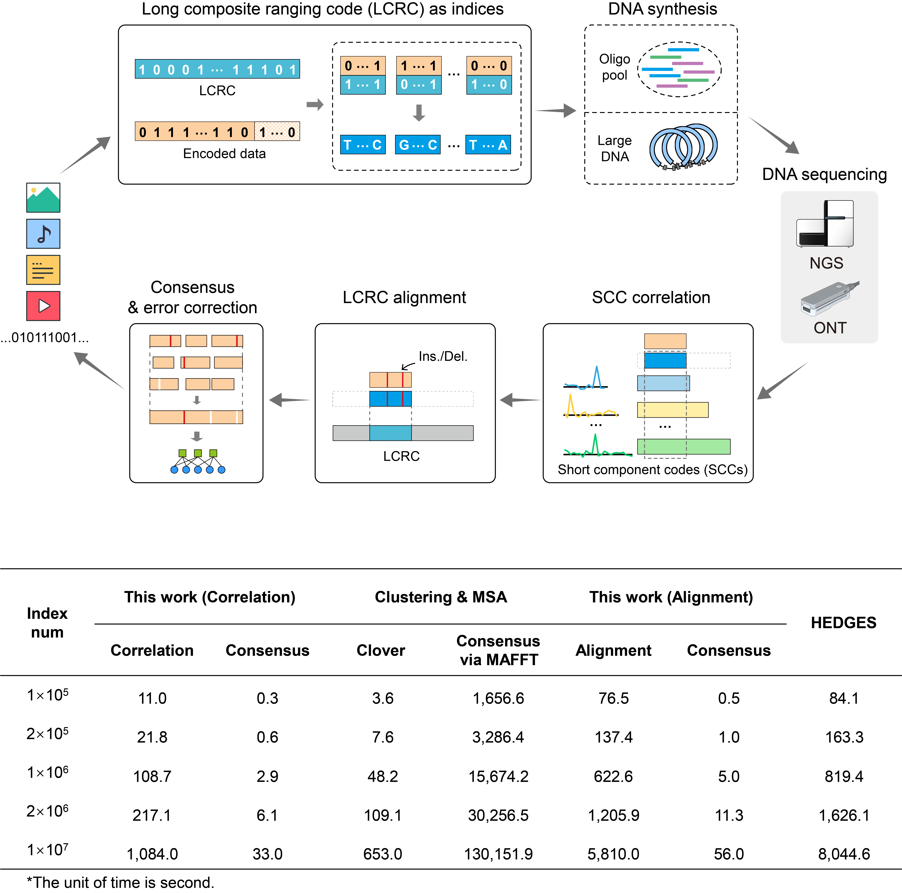

## From Spacecraft Ranging to Massive DNA Data Storage: Composite Ranging Codes as Indices and Error Correction References

The software implements an accompanying indexing and progressive recovery framework with specialized long composite ranging codes (LCRCs) for massive DNA data storage. The LCRC is constructed from a limited number of short component codes (SCCs) of similar lengths and partitioned to index massive DNA strands and to enable progressive error correction using fast correlation and robust alignment. The software is implemented in C/C++ and runs on Linux.
The software supports the following core functions:

1. Decoding for data storage with oligo pools of different scales (small-scale and medium-scale).
2. Rapid readout from short nanopore reads with read-by-read decoding.

<div align="center">

</div>

- [Source Data](#Source-Data)
- [Requirements](#Requirements)
- [Build](#Build)
- [Quick Start](#Quick-Start)
- [Usage](#Usage)

## Source Data

The source data are available on the Sequence Read Archive (SRA) under accession no. [PRJNA1371011](https://www.ncbi.nlm.nih.gov/bioproject/PRJNA1371011), including the Sequencing data generated under different synthesis/sequencing conditions (in FASTQ format):

1. Small-scale high-fidelity DNA pools
   - 1.1 HFS-Pool-11.7K + NGS (PE150)
   - 1.2 HFS-Pool-11.7K + ONT (FAST base calling)
   - 1.3 HFS-Pool-11.7K + ONT (FAST base calling) + RT, Nanopore sequencing data for real-time readout verification
2. Small-scale low-cost DNA pools
   - 2.1 LCS-Pool-11.7K + NGS (PE150)  
   - 2.2 LCS-Pool-11.7K + ONT (SUP base calling)
   - 2.3 LCS-D-Pool-11.7K (Accelerated aging pool) + NGS (PE150)
3. Medium-scale low-cost DNA pools
   - 3.1 LCS-Pool-300K + ONT (HAC base calling) + RT, Nanopore sequencing data for real-time readout verification
4. Large DNA fragment
   - 4.1 HFS-L-DNA + NGS (PE150)
   - 4.2 HFS-D-L-DNA-5h (Accelerated aging sample) + NGS (PE150)

## Requirements

Install the following dependencies on Linux:

- cmake
- BWA (https://github.com/lh3/bwa)
- PEAR (https://github.com/tseemann/PEAR)
- feh
- wmctrl

The following open-source C/C++ libraries are used in the software:

- LDPC libraries (https://github.com/radfordneal/LDPC-codes, by Radford M. Neal)
- Edlib (https://github.com/Martinsos/edlib, by Martin Šošić)
- thpool (https://github.com/Pithikos/C-Thread-Pool, by Johan Hanssen Seferidis)

## Build

A pre-compiled version is available in the **_bin_** folders under the directory **_LCRC_SmallScale_** and **_LCRC_MediumScale_**

Alternatively, users can compile the C/C++ programs using CMake:

```
# For the small-scale oligo pool
cd LCRC_SmallScale
# For the medium-scale oligo pool
cd LCRC_MediumScale

# build decoder
mkdir build && \
cd build && \
cmake .. && \
make
```

## Quick Start

The decoding workflows for data storage using oligo pools of three distinct scales—small-scale and medium-scale—are provided.

### Ⅰ. Small-scale Oligo Pool

#### Function 1: Decoding for data storage with small-scale oligo pools

For the convenience of evaluation, users can run the integrated shell scripts directly.

Navigate to the **_LCRC_SmallScale_** folder.
Decompress the sequencing data generated after paired-end read merging (HFS-Pool-11.7K + NGS):

```
gzip -d fastq/HFS_Pool_11.7K_NGS_PEmerged.fastq.gz
```

Run the decoding process:

```
./run_decoding_oligoPool.sh fastq/HFS_Pool_11.7K_NGS_PEmerged.fastq ${thread} ${threshold} ${mode}
```

- _\${thread}_: Thread number (default value: 16).
- _\${threshold}_: Correlation threshold (default value: 0.8).
- _\${mode}_: Running mode (use 0 for the correlation-based scheme and 1 for the alignment-based scheme).

#### Function 2: Rapid readout of small-scale oligo pools from short nanopore reads with read-by-read decoding

Decompress the raw sequencing data (HFS-Pool-11.7K + ONT) and run the read-by-read decoding process:

```
gzip -d fastq/HFS_Pool_11.7K_ONT_FAST_RT.tar.gz

./run_decoding_online.sh ./fastq 0.938
```

Note: 0.938 is the threshold of the base available ratio for the offline test. In the real-time verification experiment, the threshold is set to 0.955.

### Ⅱ. Medium-scale Oligo Pool

#### Function 1: Decoding for data storage with medium-scale oligo pools

For the convenience of evaluation, users can run the integrated shell scripts directly.

Navigate to the **_LCRC_MediumScale_** folder.

If the alignment-based scheme is adopted, run the script.

```
./run_gen_LCRC_refer.sh
```

Run the decoding process:

```
./run_decoding.sh ${fastq} ${copy_num} ${thread} ${threshold} ${mode}
```

- _\${fastq}_: Sequencing dataset in FASTQ.
- _\${copy_num}_: Copy number of the designed sequence.
- _\${thread}_: Thread number.
- _\${threshold}_: Correlation threshold (default value: 0.8).
- _\${mode}_: Running mode (use 0 for the correlation-based scheme and 1 for the alignment-based scheme).

#### Function 2: Rapid readout of medium-scale oligo pools from short nanopore reads with read-by-read decoding

Run the read-by-read decoding process (alignment-based):

```
./run_decoding_realTime.sh ${fastq_folder} {threshold}
```

- _\${fastq}_: Folder storing the FASTQ files (4000 reads per FASTQ).
- _\${threshold}_: Correlation threshold (default value: 0.8).

Note: In the real-time verification experiment (HAC basecalling mode), the correlation threshold is set to 0.90.

## Usage

Detailed instructions for calling the decoding programs of different-scale datasets are as follows.

### I. Small-scale Oligo Pool

#### 1. Data Recovery for Data Storage with Small-scale Oligo Pools

For data readout, run primer identification, SCC correlation, LCRC alignment (optional), and bit-wise majority voting

Navigate to the **_LCRC_SmallScale_** folder

For Illumina paired-end sequencing data, use PEAR to merge the paired reads (optional step).

```
pear -f ${R1_fastq} -r ${R2_fastq} -o ${PEmerged_fastq}
```

Run the decoding process step by step:

```
# Create work directory
mkdir ${out_dec}

# Split the FASTQ into subfiles to facilitate multithreading
./run_split_fastq.sh ${PEmerged_fastq} ${thread} ${out_dec}/subfastq

# To perform LCRC alignment, users may alternatively run the following command to build an index for BWA (optional step):
IdentificationCons_OligoPool ${out_dec} ${out_dec}/subfastq ${out_dec}/consensus_cw.bin ${thread} ${threshold} ${mode} 1

# Run primer identification, SCC correlation, or LCRC alignment, and bit-wise majority voting
IdentificationCons_OligoPool ${out_dec} ${out_dec}/subfastq ${out_dec}/consensus_cw.bin ${thread} ${threshold} ${mode} 0

# Clean off
rm ${out_dec}/subfastq*
```

- _\${PEmerged_fastq}_: Reads assembled from paired-end merging (in FASTQ format)
- _\${out_dec}_: Output directory for decoder.
- _\${thread}_: Thread number (default value: 16).
- _\${threshold}_: Correlation threshold (default value: 0.8).
- _\${mode}_: Running mode (use 0 for the correlation-based scheme and 1 for the alignment-based scheme).

#### 2. Read-by-Read Decoding During Nanopore Sequencing

Once the sequencing data begins streaming, read-by-read decoding is performed concurrently after every 100 reads. The decoding process involves primer identification, LCRC alignment, bit-wise majority voting, and error correction. An offline verification program is provided.

```
export PATH=bin:$PATH

# Create a directory
mkdir ${out_dec}

# Perform offline readout via read-by-read decoding.
Decoder_RealTime_Online ${out_dec} ${fastq_prefix} ${thread} ${threshold} {mode} ${base_threshold} ${batch_size}
```

- _\${out_dec}_: Output directory for decoder.
- _${fastq_prefix}_: Fixed prefix of FASTQ files.
- _\${thread}_: Thread number for ECCs (default value: 29).
- _\${threshold}_: Correlation threshold (default value: 0.8).
- _\${mode}_: Running mode (use 0 for the correlation-based scheme and 1 for the alignment-based scheme).
- _\${base_threshold}_: Threshold of base available ratio (default value: 0.938).
- _\${batch_size}_: Read number per FASTQ file (default value: 100).

### Ⅱ. Medium-scale Oligo Pool

#### 1. Data Recovery for Data Storage with Medium-scale Oligo Pools

For data readout, run primer identification, SCC correlation, LCRC alignment (optional), bit-wise majority voting, and error correction

Navigate to the **_LCRC_MediumScale_** folder

Run the decoding process step by step:

```
# Create work directory
mkdir ${out_dec}

# To perform LCRC alignment, users may alternatively run the following command to build an index for BWA (optional step):
Gen_LCRC

# Split the FASTQ into subfiles to facilitate multithreading
split -a5 --additional-suffix=.fastq -l $lines_per_file -d $src_fastq

# Run primer identification, SCC correlation, or LCRC alignment, bit-wise majority voting, and error correction
Decoder_OligoPool ${out_dec} ${log_dec} ${folder_subfastq} ${thread} ${threshold} ${mode} 0

```

- _\${out_dec}_: Output directory for decoder.
- _\${log_dec}_: Log directory for decoder.
- _\${src_fastq}_: Sequencing reads (in FASTQ format)
- _\${lines_per_file}_: Lines in each subfile (read number \* 4)
- _\${folder_subfastq}_: Folder storing subfiles (in FASTQ format)
- _\${thread}_: Thread number.
- _\${threshold}_: Correlation threshold (default value: 0.8).
- _\${mode}_: Running mode (use 0 for the correlation-based scheme and 1 for the alignment-based scheme).

#### 2. Read-by-Read Decoding During Nanopore Sequencing

Once the sequencing data begins streaming, read-by-read decoding is performed concurrently after every 4000\*4 reads. The decoding process involves primer identification, LCRC alignment, bit-wise majority voting, and error correction. An offline verification program is provided.

```
export PATH=bin:$PATH

# Create a directory
mkdir ${out_dec} ${log_dec}

# Perform offline readout via read-by-read decoding.
Decoder_RealTime ${out_dec} ${log_dec} ${chipA_fastq_prefix} ${chipB_fastq_prefix} ${fastq_num} ${thread} ${threshold} {mode} ${base_threshold} ${batch_size}
```

- _\${out_dec}_: Output directory for decoder.
- _\${log_dec}_: Log directory for decoder.
- _\${chipA_fastq_prefix}_: Fixed prefix of FASTQ files (chip A).
- _\${chipB_fastq_prefix}_: Fixed prefix of FASTQ files (chip B).
- _\${fastq_num}_: Process FASTQ number per period (default value: 4).
- _\${thread}_: Thread number.
- _\${threshold}_: Correlation threshold (default value: 0.8).
- _\${mode}_: Running mode (use 0 for the correlation-based scheme and 1 for the alignment-based scheme).
- _\${base_threshold}_: Threshold of base available ratio (default value for HAC base-calling mode: 0.90).
- _\${batch_size}_: Read number per FASTQ file (default value: 4000).


